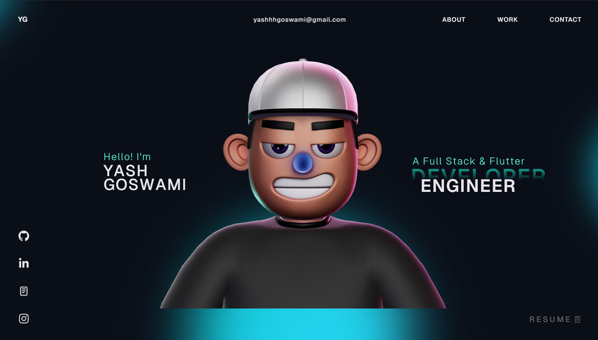

<div align="center">

# ✦ Yash Goswami — Personal Portfolio

[](https://yashhgoswami.vercel.app)
[](https://github.com/yashhhgoswami)
[](https://www.linkedin.com/in/yashhhgoswami/)
[](mailto:yashhhgoswami@gmail.com)

<br/>

> **A visually immersive personal portfolio** built with React, TypeScript, GSAP, and Three.js — featuring interactive 3D scenes, smooth animations, and a cinematic design language.

<br/>



</div>

---

## 🧑‍💻 About Me

I'm **Yash Goswami**, a final-year B.Tech student in Electronics and Communication Engineering at **IIIT Senapati, Manipur** (2022–2026). I specialize in full-stack development, WebRTC systems, and interactive UI engineering.

- 🏢 **Software Developer** at [Teachrity](https://teachrity.com) — building AI-powered classroom simulation platforms
- 🔬 Former **Quantum Computing Intern** at DRDO India
- 🎓 Placed at **Deloitte USI** via campus recruitment
- 📞 +91-7850032749

---

## ⚙️ Tech Stack

| Layer | Technologies |
|-------|-------------|
| **Frontend** | React.js, TypeScript, GSAP, Three.js, WebGL, HTML, CSS |
| **3D / Animation** | `@react-three/fiber`, `@react-three/drei`, `@react-three/rapier`, GSAP Club Plugins |
| **Build Tools** | Vite, ESLint, TypeScript Compiler |
| **Deployment** | Vercel, Vercel Analytics |

---

## 🚀 Getting Started

### Prerequisites
- **Node.js** v18+
- **npm** or **yarn**

### Installation

```bash
# Clone the repository
git clone https://github.com/yashhhgoswami/yashhgoswami.git
cd yashhgoswami

# Install dependencies
npm install

# Start the development server
npm run dev
```

The site will be live at **`http://localhost:5173`**

### Build for Production

```bash
npm run build
npm run preview
```

---

## ⚠️ GSAP Plugin Note

This repository uses **GSAP Trial plugins** for local development. The trial version **cannot be used for public hosting**.

To deploy with full Club plugins, grab your license here:
👉 [gsap.com/docs/v3/Installation](https://gsap.com/docs/v3/Installation/)

---

## 📁 Project Structure

```
rajesh-portfolio/
├── public/
│   └── images/          # Static assets & preview
├── src/
│   ├── components/      # Navbar, Landing, About, Work, Contact, etc.
│   └── ...
├── index.html
├── vite.config.ts
└── package.json
```

---

## 🏆 Highlights

- 🥇 Winner of **CodeHunt**, **CyberSleuth**, and Valorant tournament at annual tech fest
- 📝 Led the **IIITians Network** content team for 6 months
- 🚀 Built production-ready apps: [RailGuard](https://railguard-dashboard.onrender.com/) · [YG Motors](https://yg-motors.vercel.app/)

---

## 📄 License

This project is open source and available under the [MIT License](LICENSE).

---

<div align="center">

Made with ❤️ by **[Yash Goswami](https://github.com/yashhhgoswami)**

</div>
